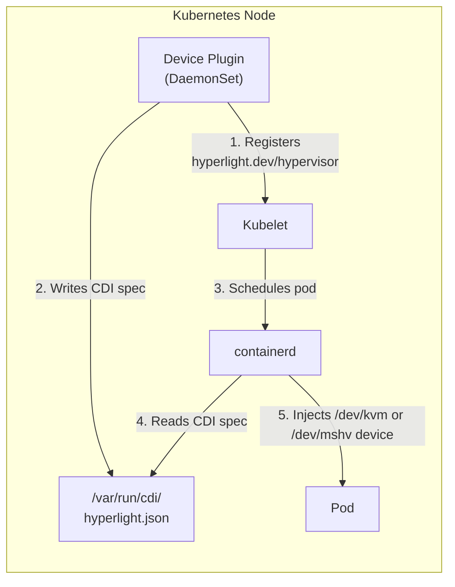

# Architecture

How the Hyperlight Device Plugin works.

## Overview

The device plugin enables Hyperlight sandboxes to run in Kubernetes **without privileged containers** by:

1. Granting the trusted plugin one hypervisor device through the bootstrap device-access DaemonSet
2. Detecting and validating the injected hypervisor device (`/dev/kvm` or `/dev/mshv`)
3. Registering them as schedulable resources with kubelet
4. Using CDI to inject devices into containers at runtime



## Bootstrap device access

The manifest deploys two DaemonSets from the same image. `hyperlight-device-access` runs `--device-access` and inventories the existing character device without opening it. It registers exactly one `hyperlight.dev/device-access` allocation per node through a separate kubelet socket. Its Allocate response contains only a read/write `DeviceSpec` for the detected hypervisor path; it does not write CDI, grant other devices, or claim VM usability.

The main `hyperlight-device-plugin` DaemonSet requests that allocation. Kubelet passes the device to the runtime, which grants the corresponding device-cgroup access before starting the main plugin. The main container performs the real KVM check on its injected device. A read-only host `/dev` mount at `/host-dev`, selected by `HOST_DEVICE_DIR`, lets the same bounded helper verify that the host character device still exists and has the same device number. This host path is the one CDI must resolve for a fresh allocation; its disappearance or replacement blocks workload allocation even if the injected node remains usable. Without `HOST_DEVICE_DIR`, the helper checks the original device path, suitable for running directly on a node. The bootstrap pod has no dependency on the main resource, so it can start on a fresh node. Both containers remain non-privileged; neither changes host device ownership or permissions. Reserve `hyperlight.dev/device-access` for this trusted infrastructure in the cluster's admission or quota policy. Application pods continue to request `hyperlight.dev/hypervisor`.

The extra DaemonSet adds one small infrastructure container per enabled node. Its advertised allocation is a device-access grant, not a promise of hypervisor health. The main plugin remains responsible for workload health, CDI repair and usable allocation. Delete both DaemonSets when uninstalling the manifest; do not remove unrelated CDI files or kubelet sockets.

## Device Plugin API

The plugin implements the Kubernetes Device Plugin API:

### Registration

On startup, the plugin:
1. Detects `/dev/mshv` or `/dev/kvm` on the node
2. Connects to kubelet at `/var/lib/kubelet/device-plugins/kubelet.sock`
3. Registers the `hyperlight.dev/hypervisor` resource

### ListAndWatch

Reports device health to kubelet:
- Validates device usability and the plugin-owned CDI specification before sending the initial device list.
- Repeats validation every 30 seconds; failed validation marks every allocation unhealthy. Checks completed during Allocate also wake all active health streams immediately.
- Repairs missing, malformed or stale CDI and restores healthy advertisement after validation succeeds. Kubelet updates allocatable resources accordingly.

### Allocate

When a pod requests `hyperlight.dev/hypervisor`:
1. Kubelet calls the plugin's `Allocate()` method
2. Plugin rechecks device usability and CDI, rejects unknown allocation IDs, then returns a CDI device reference
3. containerd reads the CDI spec and mounts the device

## CDI (Container Device Interface)

CDI is a standard for declaratively specifying device injection.

### CDI Spec

Written to `/var/run/cdi/hyperlight.json`:

```json
{
  "cdiVersion": "0.6.0",
  "kind": "hyperlight.dev/hypervisor",
  "devices": [
    {
      "name": "kvm",
      "containerEdits": {
        "deviceNodes": [
          {
            "path": "/dev/kvm",
            "type": "c",
            "permissions": "rw",
            "uid": 65534,
            "gid": 65534
          }
        ],
        "env": [
          "HYPERLIGHT_HYPERVISOR=kvm", // or mshv
          "HYPERLIGHT_DEVICE_PATH=/dev/kvm" // or /dev/mshv
        ]
      }
    }
  ]
}
```

### Readiness and repair

The plugin owns only `/var/run/cdi/hyperlight.json`. Its exact configured specification includes the CDI kind, device name, path, permissions, UID/GID and environment. Drift, including additional container edits, is replaced using a temporary file in the same directory followed by an atomic rename. Readers see either complete version. Other CDI files are untouched; a symlink or non-regular owned path is refused. An unreadable or unwritable directory remains unhealthy until the operator restores access. CDI repair does not modify host device ownership or permissions or terminate existing guests.

For KVM, a helper opens the character device read/write, verifies API version 12, creates an empty VM and closes it without allocating guest memory or vCPUs. See the [Linux KVM API](https://docs.kernel.org/virt/kvm/api.html). Each helper has a two-second deadline. If a kernel operation prevents it from exiting, the plugin refuses further probes until that helper is reaped rather than accumulating processes. MSHV currently receives a character-device/open check only; this does not establish successful MSHV VM creation.

The bootstrap allocation gives the trusted plugin explicit hypervisor device access through kubelet and the container runtime. Host permissions and security policy still apply; denial fails readiness without changing those policies. The probe establishes usability for the plugin, not admission or device access for every application security context; fresh guest execution remains a separate acceptance check.

The liveness probe performs a gRPC health request to the running server. Readiness additionally requires a successful, deadline-bounded kubelet registration, an active `ListAndWatch` stream and a successful readiness check. Socket existence alone satisfies neither probe. Registration failures stop the attempted server before retrying; kubelet socket cleanup causes the server to be recreated and registered again.

Cancelled allocation requests do not replace shared health observations. Waiting for an active check respects the caller deadline. A new probe first reaps any cancelled helper within its two-second budget before starting another; a helper that cannot exit within that budget remains a device-health failure. UID/GID configuration is parsed as unsigned 32-bit values, matching CDI; invalid values retain the default ownership.

Offline regression checks run with `cd device-plugin && go test -race -count=1 -timeout=90s ./...`. Live acceptance must separately verify existing guests and fresh allocations while removing or corrupting only the owned CDI file, making its storage temporarily unwritable, denying device access, and restarting kubelet. Restore the exact original state and verify recovery and application-owner cleanup. These tests do not establish production capacity or node fencing.

### Device Injection

When containerd creates a container:
1. Reads the CDI spec
2. Creates `/dev/kvm` (or `/dev/mshv`) device node inside container
3. Sets uid/gid to match the configured values (default: 65534/nobody)
4. Sets environment variables

**No privileged mode required!**

## Device Count

The plugin advertises multiple "devices" (default: 2000 per node), but there's only one physical hypervisor device.

### Why?

The Kubernetes Device Plugin API was designed for discrete hardware (GPUs, NICs). But `/dev/kvm` and `/dev/mshv` are **shared** - they can serve thousands of concurrent VMs.

We use the "count" pattern (same as [generic-device-plugin](https://github.com/squat/generic-device-plugin) uses for `/dev/fuse`):

| What it means | What it's NOT |
|---------------|---------------|
| Concurrent allocations allowed | Physical device count |
| Scheduling limit | Hard VM limit |
| "Slots" on this node | Unique devices |

### Configuration

Set via environment variables in the device plugin DaemonSet:

```yaml
env:
  - name: DEVICE_COUNT
    value: "5000"  # Increase for high-density nodes
  - name: DEVICE_UID
    value: "65534"  # UID for device node inside containers (nobody)
  - name: DEVICE_GID
    value: "65534"  # GID for device node inside containers (nobody)
```

| Variable | Default | Description |
|----------|---------|-------------|
| `DEVICE_COUNT` | `2000` | Number of concurrent allocations per node |
| `DEVICE_UID` | `65534` | UID for the device node in containers (nobody) |
| `DEVICE_GID` | `65534` | GID for the device node in containers (nobody) |

> **Note:** The `DEVICE_UID` and `DEVICE_GID` should match the user your pods run as. If your pods use `runAsUser: 65534` (nobody), set `DEVICE_UID=65534` and `DEVICE_GID=65534`.

| Hypervisor | Recommended Count | Notes |
|------------|-------------------|-------|
| KVM | 2000+ | Limited by node memory/CPU, not KVM |
| MSHV | ~2000 | Microsoft Hypervisor has limits per node |

## Security Model

Hyperlight workloads run with **minimal privileges**:

### Pod Security Context

```yaml
securityContext:
  runAsNonRoot: true
  runAsUser: 65534
  runAsGroup: 65534
  seccompProfile:
    type: RuntimeDefault
```

### Container Security Context

```yaml
securityContext:
  allowPrivilegeEscalation: false
  readOnlyRootFilesystem: true
  capabilities:
    drop:
      - ALL
```

### Device Ownership

The CDI spec sets device uid/gid to match the container user:

```json
"uid": 65534,
"gid": 65534
```

This allows the non-root container process to access the hypervisor device.

## Scheduling

Pods target specific hypervisors using `nodeSelector` and get device access via resource requests:

```yaml
spec:
  nodeSelector:
    hyperlight.dev/hypervisor: kvm  # or mshv
  containers:
    - name: app
      resources:
        limits:
          hyperlight.dev/hypervisor: "1"
```

| Component | Purpose |
|-----------|---------|
| `nodeSelector` | Ensures pod lands on a node with the specified hypervisor |
| Resource request | Triggers CDI injection of `/dev/kvm` or `/dev/mshv` |

## Node Labels

The device plugin automatically labels nodes based on detected hypervisor:

| Label | Values | Purpose |
|-------|--------|---------|
| `hyperlight.dev/enabled` | `true` | Device plugin runs on this node |
| `hyperlight.dev/hypervisor` | `kvm` or `mshv` | Which hypervisor is available |

## Next Steps

- [Local Development](local-development.md) - Test locally with KIND
- [Azure Deployment](azure-deployment.md) - Deploy to AKS
- [GHCR Publishing](ghcr-publishing.md) - Publish images publicly
